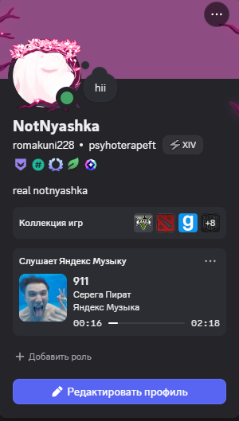

# YandexMusicRPC

Приложение для Windows 10/11, которое показывает текущий трек Яндекс Музыки в Discord Rich Presence.

## Как выглядит

<p align="center">
  
</p>

<p align="center">
  
</p>

## Возможности

- официальное приложение Яндекс Музыки и браузеры;
- название, исполнитель, обложка и нативная шкала прогресса Discord;
- кликабельная обложка, название и кнопка **«Открыть трек»**;
- статус паузы и автоматическая очистка;
- подробный, минималистичный и приватный стили;
- выбор источника воспроизведения;
- окно настроек и работа в системном трее;
- автозапуск, переподключение к Discord и защита от двух копий;
- локальная диагностика и журналы с ограниченным размером;
- portable EXE и обычный установщик.

## Установка

Скачайте `YandexMusicRPC-Setup.exe` со страницы GitHub Releases и запустите его. После установки включите трек и убедитесь, что запущено настольное приложение Discord.

Никакие Bot Token, Client Secret, пароль Discord или пароль Яндекса не нужны.

## Настройки

Щёлкните правой кнопкой по жёлтой иконке в системном трее:

- **Настройки** — источник, стиль карточки, пауза, ссылка и автозапуск;
- **Открыть Яндекс Музыку** — открыть текущий трек;
- **Скопировать диагностику** — подготовить данные для GitHub Issue;
- **Открыть папку журнала** — открыть локальные настройки и журналы.

Файлы пользователя находятся в:

```text
%LOCALAPPDATA%\YandexMusicRPC
```

## Сборка из исходников

Требуется 64-битный Python 3.12:

```powershell
Set-ExecutionPolicy -Scope Process Bypass
.\build.ps1
```

Результаты:

```text
dist\YandexMusicRPC.exe
dist\YandexMusicRPC-Setup.exe
```

Для сборки установщика нужен Inno Setup 6. Если его нет, `build.ps1` всё равно создаст portable EXE.

## Разработка

```powershell
.\run-dev.ps1
```

Проверки:

```powershell
.\.venv\Scripts\ruff.exe check src tests main.py
.\.venv\Scripts\pytest.exe
```

## Ограничения

- источник должен передавать метаданные в медиасессию Windows;
- Discord сам определяет порядок карточек активности;
- верхняя подпись «Слушает …» использует название Discord-приложения;
- поиск обложки и точной ссылки использует неофициальную библиотеку Яндекс Музыки и может не найти редкие или локальные треки.

## Конфиденциальность

Приложение читает только метаданные активной медиасессии Windows. Аудио, пароли и токены не читаются. Название трека передаётся Discord для Rich Presence и Яндекс Музыке для поиска публичной обложки и ссылки.

## Лицензия

MIT. См. [LICENSE](LICENSE).
